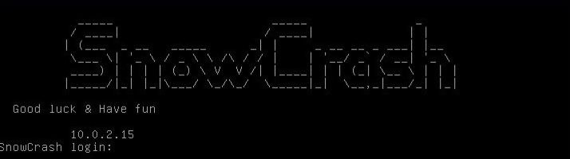
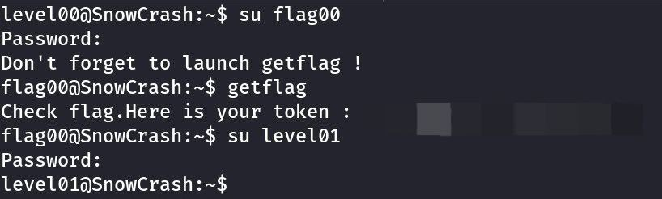

<h1 align="center"> 🗣 Subject &nbsp;&nbsp;&nbsp;&nbsp;snow crash</h1>

 

<h2>Description</h2>

 

This project is an introduction to computer security. Snow Crash will make you discover security in various sub-domains, with a developer-oriented approach.
You will become familiar with several languages (ASM/perl/php…), develop a certain logic to understand unknown programs, and become aware of problems linked to simple programming errors

 

<h2>Introduction</h2>

 

As a developer, you may have to work on softwares that will be used by hundreds of
persons in your career.  
If your software shows some weaknesses, these weaknesses will expose the users
through your software.  
It is your duty to understand the different techniques used to exploit these weaknesses
in order to spot them and avoid them.  
This project is a modest introduction to the wide world of cyber security. A world
where you’ll have no margin for errors.

 

<h2>General instructions</h2>

 
<ul>
  <li>To make this project, you will have to use a VM(64 bits). Once you have started your machine with the ISO provided with this subject, if your configuration is right, you will get a simple prompt with an IP</li>
</ul>
 

 

> [!TIP]
> If the IP address is not visible, you will get it with the command <b>ifconfig</b> once you’re connected.

 
<ul>
  <li>Then, you will be able to register using the following couple of login : level00, password : level00</li>
  <li>You really should use the SSH connection available on port 4242</li>
</ul>

<ul>
  <li>Once registered, you’re gonna have to find the password that will log you in with the "<b>flagXX</b>" account(XX = current level number)</li>
</ul>
 

> [!TIP]  
> Once logged to the "<b>flagXX</b>" account, launch the "<b>getflag</b>" command. It will give you the password to connect to the next level (You may not be able to connect to a "<b>flagXX</b>" account - in this case,
> you will have to find an alternative method, like a command injection on the program depending on its rights, for instance!)

 
<ul>
  <li>Here is a session example:</li>
</ul>

<ul>
  <li>To help you with some levels, you’re gonna have to use external softwares. You should learn to use the <b>SCP</b> command</li>
</ul>
 

> [!TIP]
> <b>/tmp/</b> and <b>/var/tmp/</b> folders have limited rights and will be reset from time to time. You should not work directly on the machine

 
<ul>
  <li>Nothing is left to chance. If there is a problem, start wondering if your code is not the cause</li>
</ul>
 

<h2>Mandatory part</h2>

 
<ul>
  <li>If you plan to use a specific external software, you must set up a specific environment (VM, docker, Vagrant)</li>
  <li>You’re invited to create scripts that will make you stall, but you will have to explain them during the evaluation</li>
  <li>For the mandatory part, you must complete the following list of levels:</li>
  <ul>
    <li>level00</li>
    <li>level01</li>
    <li>level02</li>
    <li>level03</li>
    <li>level04</li>
    <li>level05</li>
    <li>level06</li>
    <li>level07</li>
    <li>level08</li>
    <li>level09</li>
  </ul>
</ul>
 

> [!CAUTION]
> You cannot bruteforce the ssh flags. This would be useless anyway, since you will have to justify your solution during the evaluation.

 

<h2>Bonus part</h2>
 

> [!CAUTION]
> Bonus will be taken into account only if the mandatory part is PERFECT. PERFECT meaning it is completed, that its behavior cannot be faulted, even because of the slightest mistake, improper use, etc...
> Practically, it means that if the mandatory part is not validated, none of the bonus will be taken in consideration.

 
For the bonus part, you can complete the following list of levels: 
<ul>
  <li>level10</li>
  <li>level11</li>
  <li>level12</li>
  <li>level13</li>
  <li>level14</li>
</ul>
  

> [!NOTE]
> For ISO file please write to my email: arakelyandaviid@gmail.com
